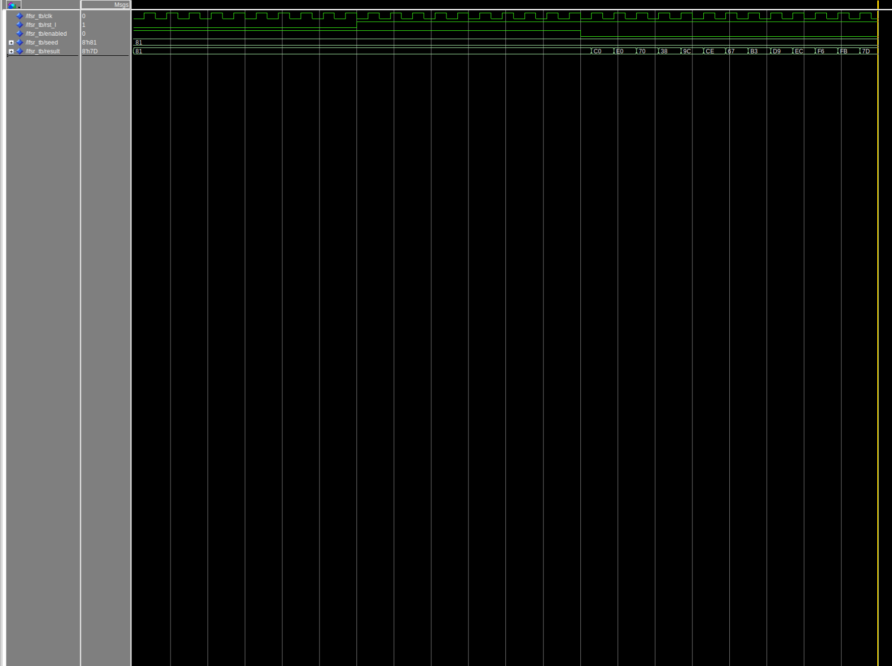

## Procedures

**Introduction.** The goal of this lab is to design, implement, and test a Linear Feedback Shift Register. constraints for this lab is to utilize the 10MHz internal clock. it will generate a random hex number every time the enable button is pressed.

The procedures for this lab are as follows

1. Create a Quartus project using the System Builder application
2. Create an initial implementation of the LFSR
3. Create a testbench to test the LFSR & verify correct behavior
4. Compile and load the LFSR onto the FPGA for visual confirmation

**Issues, Errors, and Stumbles.** This lab didn't pose too many concerns. The most complex component for this lab was the understanding of the LFSR behavior. We were tasked to maximize the number of shifting so the shifter does not repeat. Understanding on how to achieve this posed to a be small challenge. 

## Results

We first created the LFSR module, we then implemented the seven segment decoder from the previous lab to display the random numbers.

While the LFSR is maximized, we also implemented a counter that is counting on the rising edge of a clock edge. This was done so the seed is unpredictable. Thus, the series of randomly generated numbers varies. Note that this new seed is only loaded on the reset. 

## Figures and Code

The following is the main module file that contains the entity architecture.

### LFSR module
```
library ieee;
use ieee.std_logic_1164.all;
use ieee.numeric_std.all;

entity lfsr_8bit is
	port(
		-- [INPUTS] --
		clk : in std_logic;
		rst_l : in std_logic;
		enabled : in std_logic;
		seed : in std_logic_vector(7 downto 0);
		
		-- [OUTPUTS] --
		result: out std_logic_vector(7 downto 0)
	);
end entity lfsr_8bit;

architecture behavioral of lfsr_8bit is
	-- [SIGNALS] --
	signal feedback : std_logic;
	signal lfsr_reg : std_logic_vector(7 downto 0) := x"69"; -- arbitrary, known value
	
begin
	-- [PROCESSES] --
	process (clk, rst_l)
	begin		
		-- active low async reset
		if rst_l = '0' then
			lfsr_reg <= seed;
			
		elsif rising_edge(clk) and enabled = '0' then
			-- shift the bits to the right
			lfsr_reg <= feedback & lfsr_reg(7 downto 1);
		end if;
	end process;
	
	-- [SIGNAL CONNECTIONS] --
	feedback <= lfsr_reg(7) xor lfsr_reg(5) xor lfsr_reg(4) xor lfsr_reg(3);
	result <= lfsr_reg;

end architecture behavioral;
```

### Top Level Module
```
library ieee;
use ieee.std_logic_1164.all;
use ieee.numeric_std.all;

entity rng is 
	port(
		-- [Inputs] --
		ADC_CLK_10: in std_logic;
		KEY: in std_logic_vector(1 downto 0);
		
		-- [Outputs] --
		HEX0: out std_logic_vector(7 downto 0);
		HEX1: out std_logic_vector(7 downto 0)
	);	
end entity rng;

architecture behavioral of rng is
	-- [COMPONENTS] --
	component seg
		port(
			point: in std_logic;
			count: in std_logic_vector(3 downto 0);
			display: out std_logic_vector(7 downto 0)
		);
	end component seg;
	
	component lfsr_8bit
		port(
			clk : in std_logic;
			rst_l : in std_logic;
			enabled : in std_logic;
			seed : in std_logic_vector(7 downto 0);
			result: out std_logic_vector(7 downto 0)
		);
	end component lfsr_8bit;
	
	-- [SIGNALS] --
	signal clk_count : unsigned(7 downto 0);
	signal count_vector : std_logic_vector(7 downto 0);
	
	signal lfsr_out_vector : std_logic_vector(7 downto 0) := (others => '0');
	
	signal seg0_out_vector : std_logic_vector(3 downto 0);
	signal seg1_out_vector : std_logic_vector(3 downto 0);
	
begin
	-- [INSTANCES] --
	seg0_impl : seg port map(
		point => '0',
		count => seg0_out_vector,
		display => HEX0
	);
	
	seg1_impl: seg port map(
		point => '0',
		count => seg1_out_vector,
		display => HEX1
	);
	
	lfsr_impl : lfsr_8bit port map(
		clk => ADC_CLK_10,
		rst_l => KEY(0),
		enabled => KEY(1),
		seed => count_vector,
		result => lfsr_out_vector
	);
	
	-- [EXTERNAL BEHAVIOR] --
	count_vector <= std_logic_vector(clk_count);
	
	-- [PROCESSES] --
	process (ADC_CLK_10, KEY)
	begin
		if KEY = "10" then
			-- reset
			clk_count <= (others => '0');
			
		elsif rising_edge(ADC_CLK_10) and KEY = "11" then
			-- neither button is pressed, increase the count (the seed)
			clk_count <= clk_count + 1;
		end if;
		
		if KEY = "11" then
			-- no key is being pressed
			seg0_out_vector <= lfsr_out_vector(3 downto 0);
			seg1_out_vector <= lfsr_out_vector(7 downto 4);
		else
			seg0_out_vector <= (others => '0');
			seg1_out_vector <= (others => '0');
		end if;
	end process;

end architecture behavioral;
```

### Test bench
```
library ieee;
use ieee.std_logic_1164.all;
use ieee.numeric_std.all;

entity LFSR_tb is
end LFSR_tb;

architecture behavioral of LFSR_tb is
    -- instatiate LFSR
   	component lfsr_8bit
		port(
			clk : in std_logic;
			rst_l : in std_logic;
			enabled : in std_logic;
			seed : in std_logic_vector(7 downto 0);
			result: out std_logic_vector(7 downto 0)
		);
	end component lfsr_8bit;

    signal clk      : std_logic := '0';
    signal rst_l    : std_logic := '0';
    signal enabled  : std_logic := '1';   --active low
    signal seed     : std_logic_vector(7 downto 0) := "10000001";
    signal result   : std_logic_vector(7 downto 0);

    constant CLK_PERIOD : time := 30 ns;

begin
    uut: lfsr_8bit port map(
        clk => clk,
        rst_l => rst_l,
        enabled => enabled,
        seed => seed,
        result => result
    );

	clk_process : process
	begin
		clk <= '0';
		wait for clk_period / 2;
		clk <= '1';
		wait for clk_period / 2;
	end process;

    key_process : process
    begin
        rst_l <= '0';
        wait for clk_period * 10;
        rst_l <= '1';
        wait for clk_period * 10;
        enabled <= '0';
        wait;
    end process;
end architecture behavioral;
```

The following image shows the simulation of the design through Questa.


## Conclusion
This lab has demonstrated our understanding of Pseudo-Randomization in a defined system. In addition, this lab has provided more insight into gaps of our knowledge. Learning about the uses of the LFSR and how changing the taps changes the shifting behavior.
