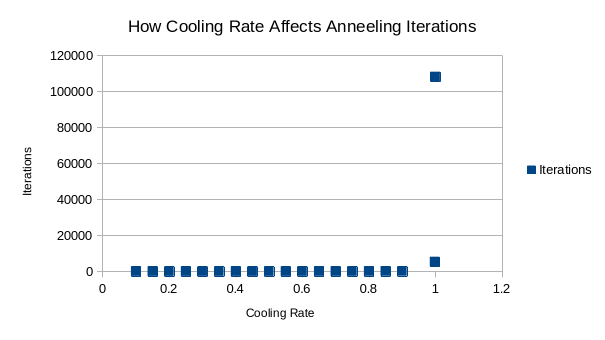
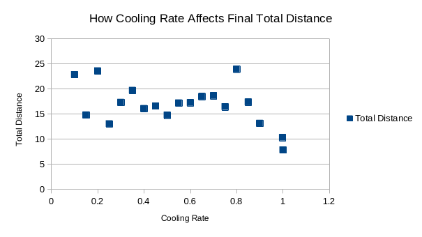

## Procedures

**Introduction.** The goal of this lab is to gain experience in designing and implementing an algorithm that utilizes Simulated Annealing. 

The procedures for this lab are as follows:

1. Create a new C/C++ project.
2. Create the scaffolding of a simulated annealing program.
3. Adapt the algorithm to aid in solving the FPGA placement problem.
4. Testing and validation of the software.

**Issues and Stumbles.** Understanding how simulated annealing algorithm operates as a whole was not complex nor was it difficult. The challenge was how it can be applied when solving problems. In our case, trying to minimize the total distance between FPGA nodes had many approaches, many of which made the solution complicated. 

For example, determining the best way to represent the grid while ensuring enough flexibility was difficult to determine. At first, we represented the grid as a 2D vector that represented the location of a node, and the connections of a node. However, this approach made it difficult to rearrange the nodes efficiently and accurately. Next, we tried to utilize the C++ matrix library to represent the graph's data, but we found this approach did not solve the issues we were having from the 2D vector. In the end, we assigned each node an index, and created two vectors: one that represents each node's position and another that represents the edges of each node. 

Once the graph could be represented with little complexity, we had to determine how to create each solution. There were many options that we thought about: swapping two nodes, randomly placing two nodes in an empty space, or flipping a row or column of nodes. In the end, we decided the best way to create a new possible solution was to move the first two nodes of the graph to a new random, empty space. This decision wasn't the result of detailed analysis of optional solution finding-- it simply was the easiest to implement.

## Results & Figures

When analyzing how the annealing algorithm works, its intuitive that decreasing the cooling rate increases the total number of iterations. However, the following *Figure 1* shows a dramatic, steep incline in the number of iterations when the cooling rate is `0.1`.

*Figure 1. How Cooling Rates Affect Annealing Iterations* 

In addition, the following *Figure 2* shows how effective the simulated annealing algorithm by comparing the total distance at the final annealing iteration to the annealing cooling rate.

*Figure 2. How Cooling Rates Affect Final Total Distance*

This figure reveals that there is a tight relationship between the final total distance and the cooling rate. Of course, we do not want to cool too fast, otherwise the algorithm will not reach an optimal solution fast enough. However, we don't want to want to cool too slow, either, because the software will take a substantial amount of time to execute. 
As shown by *Figure 1*, the number of annealing iterations dramatically increases when the cooling rate becomes too small. Thus, a fine balance needs to be found where the simulation cools slow enough to reach a minimum, but fast enough to decrease the number of total annealing iterations. In the end, we determined a cooling rate of `0.998` is slow enough to find an optimal solution, but fast enough to be quick to compute with approximately 5,000 iterations.

## Conclusion
In this lab, the simulated annealing algorithm was successfully designed and implemented to solve the FPGA placement problem. A significant challenge was representing the FPGA grid and nodes in a way that was both flexible and efficient for rearranging nodes. After exploring options like 2D vectors and a matrix library, a solution using two vectors—one for node positions and another for edges—proved to be the most effective.

The results demonstrated a clear trade-off in the cooling rate parameter. While a slower cooling rate allows the algorithm to explore more solutions and find a more optimal placement by minimizing total distance, it dramatically increases the number of iterations required. Conversely, a faster rate is less computationally expensive but risks settling on a suboptimal solution. Therefore, the key to effectively applying simulated annealing to this problem lies in finding a balanced cooling rate that achieves a near-optimal solution within a reasonable number of iterations.